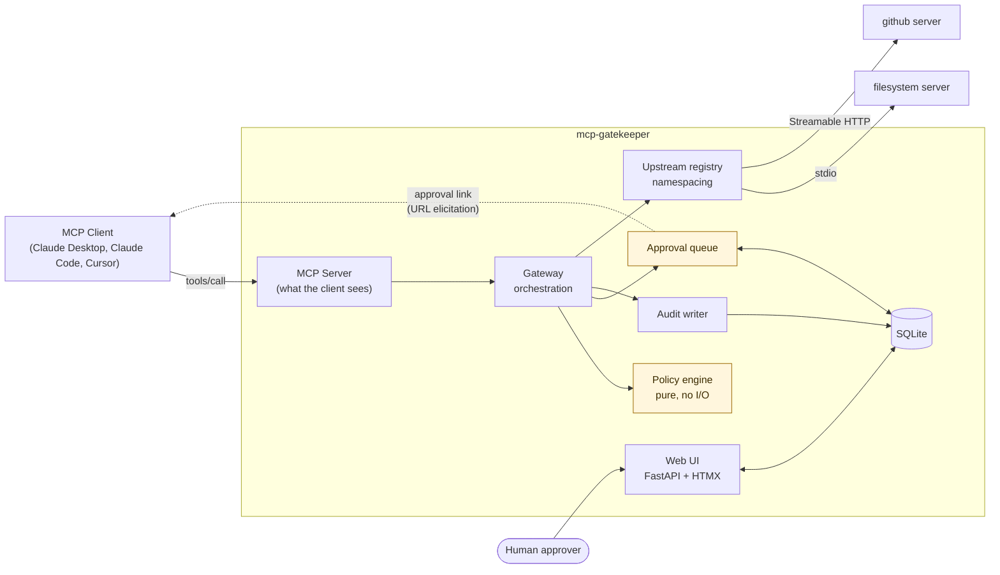

# mcp-gatekeeper

**A governance layer for MCP servers: policy, human approval, and an audit trail for every tool call your AI agent makes.**

[](https://github.com/saimsheikh/mcp-gatekeeper/actions/workflows/ci.yml)
[](https://www.python.org/)
[](LICENSE)

---

## Why this exists

The Model Context Protocol lets AI clients call tools on MCP servers. In practice that means plugging in a server and handing the model **everything it exposes, immediately, unsupervised**. Connect the filesystem server and the model can read any file in scope — and delete them. Nobody is asked. Nothing is written down.

That is fine on a laptop. It is a non-starter the moment an agent touches a production database, a customer record, or a payment system. The blocker to shipping agents inside a company is rarely capability; it is that nobody can answer *"what is this thing allowed to do, who approved it, and what did it actually do last Tuesday?"*

mcp-gatekeeper sits between the client and the servers and answers all three.

- **Policy** — a YAML file decides `allow`, `deny`, or `require_approval` per tool, with glob patterns, argument matching, and rules that key off a tool's own behaviour annotations.
- **Approval** — risky calls pause for a human, who approves or denies in a small web UI. No answer within the timeout is a denial.
- **Audit** — every call is recorded with its arguments, decision, approver, latency, and result, browsable in the UI and exportable as JSONL.

It is invisible to both sides. The client believes it is talking to an ordinary MCP server; the upstream servers believe they are being called by an ordinary client. Neither needs modification.

## Architecture



A call arrives, policy decides, an approval may be requested, the survivor is forwarded, and the whole thing is written down.

## 60-second quickstart

Requires Python 3.12+ and [uv](https://docs.astral.sh/uv/).

```bash
git clone https://github.com/saimsheikh/mcp-gatekeeper
cd mcp-gatekeeper
uv sync --all-groups

# Check what a policy would do before running anything
uv run mcp-gatekeeper validate --config examples/filesystem/gatekeeper.yaml

# Start the proxy plus the approval UI
uv run mcp-gatekeeper run --config examples/filesystem/gatekeeper.yaml
```

The approval UI is at **http://localhost:8765**. Point a client at the gatekeeper (below), ask it to write a file, and watch the request appear for approval.

`validate` prints the policy as the engine will actually apply it:

```
examples/filesystem/gatekeeper.yaml is valid.

Upstreams (1):
  fs               stdio  npx -y @modelcontextprotocol/server-filesystem ./sandbox

Policy rules (11), first match wins:
   0. fs__read_*                   -> allow
   ...
   5. *                            -> deny  [path~/prod/**]
   6. *                            -> require_approval  [destructive=true]
  default: require_approval
```

## Example configuration

```yaml
version: 1

upstreams:
  - name: fs                     # tools appear as fs__read_file, fs__write_file, ...
    command: npx
    args: ["-y", "@modelcontextprotocol/server-filesystem", "./sandbox"]

  - name: github                 # a remote server over Streamable HTTP
    transport: http
    url: https://example.com/mcp

policy:
  # Anything unmatched stops for a human. A tool added upstream tomorrow is
  # governed by default rather than silently allowed.
  default: require_approval

  rules:                         # evaluated top to bottom, FIRST MATCH WINS
    - tool: "fs__read_*"
      action: allow
      reason: "Reads are non-destructive"

    - tool: "*"                  # argument-level rule
      when:
        args: { path: "/prod/**" }
      action: deny
      reason: "Production paths are off limits to agents"

    - tool: "*"                  # behaviour-level rule
      when: { destructive_hint: true }
      action: require_approval
      reason: "Tool reports itself as destructive"

approvals:
  mode: auto                     # elicit where the client supports it, block otherwise
  timeout_seconds: 300
  on_timeout: deny               # silence is not consent
  ui:
    host: 127.0.0.1
    port: 8765
    base_url: "http://localhost:8765"

audit:
  database: ./gatekeeper.db
  redact: ["**.token", "**.password", "**.api_key"]
```

### Policy reference

| Field | Meaning |
|---|---|
| `tool` | Glob over the namespaced name. `*` matches anything: `fs__*`, `*_file`, `*`. |
| `action` | `allow`, `deny`, or `require_approval`. |
| `upstream` | Restrict the rule to one upstream. Optional. |
| `when.args` | Map of dotted argument path to glob. `/` is a boundary: `*` stays in one segment, `**` crosses. All listed args must match. |
| `when.*_hint` | Match the tool's declared `read_only`, `destructive`, `idempotent`, or `open_world` annotation. |
| `reason` | Shown to the approver, to the model on denial, and in the audit log. |

Two behaviours worth knowing:

- **A trailing `/**` covers the parent too.** `/prod/**` matches `/prod` as well as `/prod/db.yaml`, so a rule guarding production is not defeated by naming the directory exactly.
- **An unstated annotation never satisfies a condition.** `None` means "not stated", never "false", so an upstream that omits annotations cannot silently widen a rule's reach.

## Wiring it into a client

### Claude Desktop

Edit `claude_desktop_config.json` (macOS: `~/Library/Application Support/Claude/`, Windows: `%APPDATA%\Claude\`):

```json
{
  "mcpServers": {
    "gatekeeper": {
      "command": "uv",
      "args": [
        "--directory", "/absolute/path/to/mcp-gatekeeper",
        "run", "mcp-gatekeeper", "run",
        "--config", "/absolute/path/to/gatekeeper.yaml"
      ]
    }
  }
}
```

Remove the upstream servers' own entries — they now live behind the gatekeeper, and leaving them configured directly gives the model an ungoverned path to the same tools.

### Claude Code

```bash
claude mcp add gatekeeper -- \
  uv --directory /absolute/path/to/mcp-gatekeeper \
  run mcp-gatekeeper run --config /absolute/path/to/gatekeeper.yaml
```

### Anything else

Over stdio, run `mcp-gatekeeper run --config gatekeeper.yaml`. Over HTTP:

```bash
mcp-gatekeeper run --config gatekeeper.yaml --transport http --port 8000
# endpoint: http://127.0.0.1:8000/mcp
```

## Docker demo

```bash
docker compose up
```

Brings up the gatekeeper over HTTP on `:8000` with the approval UI on `:8765`, wrapping the filesystem server against a sandbox directory.

## Design decisions and tradeoffs

**Built against the 2026-07-28 revision, which is stateless.** That revision removed the `initialize` handshake and protocol-level sessions; client capabilities and identity now travel in each request's `_meta`. For a proxy this is a simplification — there is no session state to mirror — but it means capabilities must be read *per request* rather than remembered. Much of the MCP proxy material written before this assumes a handshake that no longer exists.

**Approvals use multi-round-trip requests, not a back-channel.** The same revision replaced server-initiated `elicitation/create` with MRTR: the handler returns an `InputRequiredResult`, the client retries the call carrying the response. So the gatekeeper hands the client a URL pointing at the approval page and returns immediately. Nothing blocks, and no request sits open against an upstream timeout.

The catch is that returning that result to a client which never advertised URL elicitation is a **protocol error**. So `mode: auto` checks the capability per request and falls back to holding the call open. Both paths resolve against the same queue, which is what lets one web UI serve either.

**The client cannot approve its own call.** The elicitation response is only a signal to re-check; the decision of record lives in the queue. A client that retries claiming `accept` for a request no human approved is still refused.

**Denials return a tool result, not a JSON-RPC error.** The model is told *why* it was blocked and can adapt or explain to the user, instead of seeing an opaque transport failure and retrying blindly.

**First match wins, top to bottom.** "Most specific wins" needs a specificity metric nobody can predict once patterns overlap. An ordered list can be read top to bottom and reasoned about locally, at the cost of the author having to order rules deliberately.

**Policy evaluation is pure.** No I/O, no clock, no globals — a request struct and a policy in, a decision out. That is why policy matching can be exhaustively unit-tested without standing up a transport, and why a decision can never depend on something invisible in its inputs.

**Plain `sqlite3`, not an ORM.** Two tables and a handful of queries do not justify SQLAlchemy, a migration framework, and a layer of typing that pyright strict handles poorly. Calls are offloaded to worker threads; WAL mode lets the UI read while a call is writing.

**Redaction happens on write.** A secret matching a `redact` pattern never reaches the database, so it cannot leak from a backup or an export either. The cost is that it is unrecoverable after the fact — which is the point.

**Approvals persist.** Under MRTR an approved call comes back as a *fresh* request, so the decision must outlive the handler that created it. That also means a restart mid-approval does not silently drop the request.

### Known limitations

- **No authentication on the approval UI.** v0.1 binds to `127.0.0.1` and treats the approval id (192 bits of entropy) as a capability. Anyone who can reach the port and guess an id can approve. Do not expose it without putting auth in front of it. See the roadmap.
- **Pattern matching is case-sensitive.** On Windows and macOS, `/PROD/db.yaml` will not match a rule written for `/prod/**` even though it resolves to the same file. Write patterns to match the casing your clients actually send.
- **Annotations are self-reported.** `destructive_hint` reflects what the upstream *claims*. Treat annotation rules as defence in depth, not a guarantee.
- **One process, one queue.** The in-process wakeup for blocking approvals assumes the UI and the proxy share a process. Running them separately still works — resolution falls back to polling — but it is not a tested configuration.

## Roadmap

Deliberately out of scope for v0.1, with extension points left in place:

- **Authentication and multi-user approvals** — OAuth on the UI, approver identity from a real session rather than a text field, per-approver policy.
- **Rate limiting** — the gateway already sees every call; budgets per tool, per client, or per window fit behind the same interception point.
- **Richer observability** — the SDK ships `opentelemetry-api` and the spec documents `traceparent` in `_meta`, so distributed tracing is a natural next step.
- **Policy hot-reload** — currently config is read once at startup.
- **Approval routing** — Slack or email notification instead of watching a page.
- **Postgres backend** — for deployments where SQLite's single-writer model is the bottleneck.

## Development

```bash
uv sync --all-groups
uv run pytest                 # 250 tests
uv run ruff check .           # lint
uv run ruff format .          # format
uv run pyright                # strict type check
```

CI runs all four on every push. Policy matching is unit-tested exhaustively; the proxy is tested against a real MCP server over a real client, including the full approval round trip over the wire.

```
src/mcp_gatekeeper/
  policy/      pure evaluation: glob, rules, decisions
  config/      YAML schema and validation
  proxy/       upstream connections, namespacing, gateway, MCP server
  approvals/   queue, workflow, timeout
  audit/       records, redaction, storage, export
  ui/          FastAPI + HTMX approval and audit interface
  cli.py       run, validate, export
```

## License

MIT — see [LICENSE](LICENSE).
